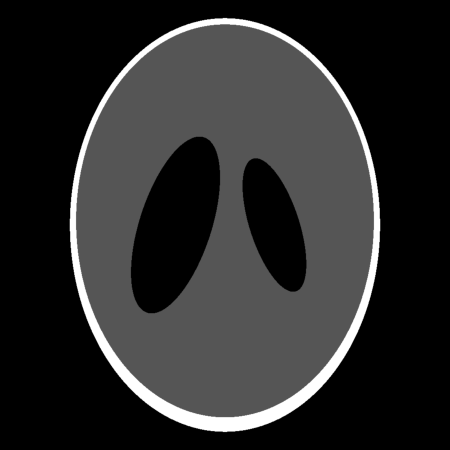
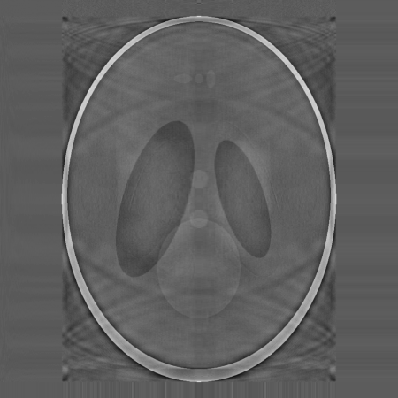
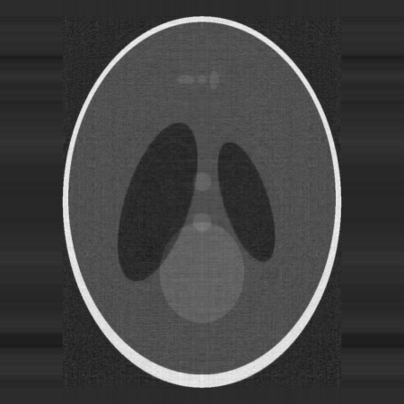
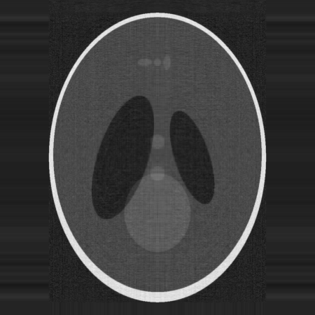

# Matrix Compressor

This repository contains code for the paper [Matrix Compression via Randomized Low Rank and Low Precision Factorization](https://arxiv.org/abs/2310.11028) by Rajarshi Saha, Varun Srivastava and Mert Pilanci (NeurIPS 2023).

We propose **LPLR** - a framework for joint rank reduction and quantization to compress large data matrices, with applications in domains such as Natural Language Processing (LLMs), Big Data Processing (retrieval and compression) and more.

LPLR exploits low rank structure to obtain a low rank decomposition of any matrix $\mathbf{A}$ as $\mathbf{A} \approx \mathbf{L}\mathbf{R}$, where $\mathbf{L}$ and $\mathbf{R}$ are the low rank factors.
The total number of elements in $\mathbf{L}$ and $\mathbf{R}$ can be significantly less than that in $\mathbf{A}$.
Furthermore, the entries of $\mathbf{L}$ and $\mathbf{R}$ are quantized to low precision formats -- compressing $\mathbf{A}$ by giving us a low rank and low precision factorization.
Our algorithm first computes an approximate basis of the range space of $\mathbf{A}$ by randomly sketching its columns, followed by a quantization of the vectors constituting this basis.
It then computes approximate projections of the columns of $\mathbf{A}$ onto this quantized basis.
The tradeoff between compression ratio and approximation accuracy allows for flexibility in choosing these parameters based on specific application requirements.

<div style="display: inline-block; width: 19%;">
  
</div>
<div style="display: inline-block; width: 19%;">
  
</div>
<div style="display: inline-block; width: 19%;">
  
</div>
<div style="display: inline-block; width: 19%;">
  
</div>
<div style="display: inline-block; width: 19%;">
  
</div>

Compression of Shepp-Logan phantom (a standard test image for medical image reconstruction). Naive quant. was done with $2$-bits per pixel of this $10^3 \times 10^3$ image. Quantizing the SVD factors ``directly" (i.e., DSVD) and (our) LPLR/LSVD algorithms factorize the image into a product of tall \& wide matrices reduces the total number of elements, allowing each entry to be represented using upto $8$-bits of precision per pixel. Despite the increase in precision per pixel, the total number of bits remains the same at $2 \cdot 10^6$.

### Algorithm

**LPLR: Randomized Low-Precision Low-Rank factorization**

**Input:** Matrix $\mathbf{A} \in \mathbb{R}^{n \times d}$, sketch size $m$, Quantizers $\mathrm{Q}$, $\mathrm{Q}'$ with dynamic ranges $\mathrm{R}_\mathrm{Q}$, $\mathrm{R}_{\mathrm{Q}'}$ and bit-budgets $\mathrm{B}, \mathrm{B}'$ respectively.

**Output:** Factorization: $\mathbf{L}\mathbf{R}$ where $\mathbf{L} \in \mathbb{R}^{n \times m}$, $\mathbf{R} \in \mathbb{R}^{m \times d}$

- Sample a Gaussian sketching matrix $\mathbf{S} \in \mathbb{R}^{d \times m}$ with entries $S_{ij} \sim {\cal N}\left(0, \frac{1}{m}\right)$.
- Compute an approximate basis of column space of $\mathbf{A}$ by forming the sketch: $\mathbf{A}\mathbf{S}$.
- Quantize the approximate basis with $\mathrm{Q}$ to get $\mathrm{Q}(\mathbf{A}\mathbf{S})$.
- Find $\mathbf{W}^* = \mathop{\rm arg \hspace{1mm} min}_{\mathbf{W}}\left\lVert{\mathrm{Q}(\mathbf{A}\mathbf{S})\mathbf{W} - \mathbf{A}}\right\rVert_{\rm F}^2$.
- Quantize $\mathbf{W}^*$ using quantizer $\mathrm{Q}'$ to get $\mathrm{Q}'(\mathbf{W}^*)$.

**Return**: Low-rank and low-precision approximation $\mathbf{L}\mathbf{R}$ where $\mathbf{L} = \mathrm{Q}(\mathbf{A}\mathbf{S})$, $\mathbf{R} = \mathrm{Q}'(\mathbf{W}^*)$.


## Citation
Please cite our work as:
```bibtex
@inproceedings{saha2023lplr,
    title={{Matrix Compression via Randomized Low Rank and Low Precision Factorization}},
    author={Rajarshi Saha, Varun Srivastava and Mert Pilanci},
    booktitle={Advances in Neural Information Processing Systems},
    year={2023}
}
```

## 🛠 Installation
Run the following command to install all dependencies in a conda environment named `lplr`. Change the cuda version for torch as required.
```
sh install.sh
```
After installation, activate the environment with
```
conda activate lplr
```

## 🚀 Trying out LPLR

## 💡 Tips


## 📊 Replicating experiments in paper

### LlaMa Layer Analysis

Replace the MODEL_DIRECTORY by the location of the unquantized model, and adjust parameters `b1`, `b2` and `cr`.

```bash
export OUTPUT_DIRECTORY="./artifacts/llama-quantized"
export MODEL_DIRECTORY="./artifacts/llama-7b-hf/"
export LOGURU_LEVEL=INFO 
stdbuf -oL python scripts/llama/layer_wise_quantization.py --model-directory $MODEL_DIRECTORY --output-directory $OUTPUT_DIRECTORY --b1 8 --b2 8 --cr 1 --map-location "cuda:1" 2>&1 | stdbuf -oL tee -i $OUTPUT_DIRECTORY/quantization-$(date +%m%d%H%M%S).log
```

### Quantization and Evaluation

```bash
export RF=0.8
export B1=16
export B2=16
export CUDA_VISIBLE_DEVICES=1
export LOGURU_LEVEL=TRACE
export INPUT_DIR=artifacts/llama-7b-hf
export OUTPUT_DIR=artifacts/llama-quantized-svd-r{$RF}-{$B1}-{$B2}

stdbuf --output=L python scripts/lplr/quantize_torch_splits_svd.py --in-path $INPUT_DIR --out-path $OUTPUT_DIR --map-device 'cuda:0' --rank-fraction $RF --b1 $B1 --b2 $B2 2>&1 | stdbuf --output=L tee $OUTPUT_DIR/quantization.log

cp artifacts/llama-7b-hf/tokenizer.model artifacts/llama-7b-hf/*.json $INPUT_DIR

stdbuf --output=L python repos/lm-evaluation-harness/main.py --model hf-causal --model_args pretrained=/home/rsaha/varun/matrix-compressor/$INPUT_DIR --tasks boolq,hellaswag,piqa 2>&1 | stdbuf --output=L tee $INPUT_DIR/evaluation.log
```